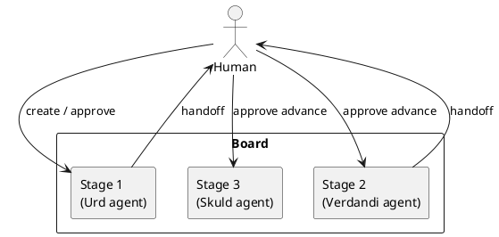
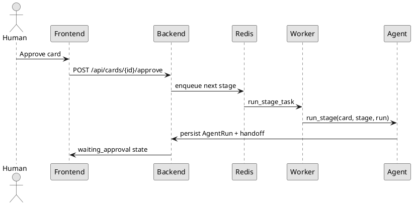

# Norns

Norns is a Kanban orchestration system where each board column runs an isolated LLM agent and a human approval gate controls progression to the next stage. The name comes from the Norse Norns: Urd, Verdandi, and Skuld.

## Features
- Local Electron IDE (`norns init` / `norns run`) — TypeScript UI in Chromium, config under `~/.norns`
- Visual state machine editor for board stages, order, and human-gate vs auto-advance
- FastAPI + async SQLAlchemy backend with PostgreSQL-ready configuration
- ARQ/Redis queue for isolated stage execution (optional; local IDE runs stages in-process)
- React + TypeScript Kanban UI with approval-aware movement
- Encrypted connector secrets at rest with Fernet
- OpenAI-compatible stage agents with explicit per-stage tool allowlists
- PlantUML-first documentation and handoff previews

## Flow Diagram


## Runtime Sequence


## Architecture Overview
- **Boards / Stages** define the workflow and per-column agent configuration. Edit them in the Control Room **Machine** view.
- **Cards** carry the work item body and current stage pointer.
- **Agent runs** are isolated; no chat memory is shared between stages.
- **Handoffs** from stage _N_ are the only structured context for stage _N+1_.
- **Connectors** are Python-library backed only (PyGithub, jira, polarion); raw credentials are never exposed to agents.

## Install and run (local IDE)
Norns is a desktop IDE, not a browser app. The Control Room UI is TypeScript in Chromium, hosted by Electron — the same window model as VS Code.

```bash
# From the repo root (not frontend/):
uv sync
cd frontend && npm install && npm run build && cd ..
bash scripts/stage-ui.sh
npm install --prefix norns/electron

uv run norns init
# Edit ~/.norns/config.toml — set openai.api_key and change admin_password
uv run norns run
```

`uv install` is not a command; use `uv sync` or `uv pip install -e .`. You need Node.js 20+ for the UI build and the Electron window.

From a built wheel (what CI packages):

```bash
python3 -m pip install dist/norns-*.whl
norns init
npm install --prefix "$(python3 -c 'import norns, pathlib; print(pathlib.Path(norns.__file__).parent / "electron")')"
norns run
```

`norns run --no-window` starts the same local server without opening a window (used by CI). Data lives under `~/.norns` unless you pass `--home` or set `NORNS_HOME`.

## Docker compose (optional)
Use this when you want PostgreSQL, Redis, and a browser-based Vite dev server instead of the desktop IDE.

1. Copy `.env.example` to `.env` and set real secrets.
2. Generate unique secrets (do not keep the example values):
   ```bash
   python -c "from cryptography.fernet import Fernet; print(Fernet.generate_key().decode())"
   python -c "import secrets; print(secrets.token_urlsafe(32))"
   ```
   Put them in `ENCRYPTION_KEY` and `SECRET_KEY`. The API and worker must share the same encryption key.
3. Start the stack:
   ```bash
   docker compose up
   ```
4. Open:
   - Frontend: `http://localhost:5173`
   - Backend API: `http://localhost:8000/docs`
5. Sign in with the `ADMIN_USERNAME` / `ADMIN_PASSWORD` from your `.env` (defaults are `admin` / `admin`).
6. Create a board, add a card, open it, and click **Run this stage**. Cards only move after approval unless a stage has auto-advance enabled.

## Development Setup
```bash
pip install -e ".[dev]"
python -m pytest backend/tests/ -q
bash scripts/lint.sh
cd frontend && npm install && npm run dev
```

Pull requests to `main` must pass the **CI** GitHub Actions check (`backend` tests, `frontend` typecheck/build, `lint` static analysis and format, `package` wheel/sdist plus `norns` CLI). Direct pushes to `main` are not blocked, but merges are.

## Notes
- Local IDE mode uses SQLite and `QUEUE_BACKEND=inline` (no Redis). Docker/production can keep Redis via `QUEUE_BACKEND=redis`.
- Use PostgreSQL in normal deployments via `DATABASE_URL`.
- Redis backs ARQ worker execution.
- PlantUML/Kroki rendering is opt-in via `PLANTUML_URL` / `KROKI_URL` (unset means no public egress).
- An empty per-stage tool allowlist grants **no** tools. Enable GitHub, Jira, or Polarion explicitly on the stage.
- `PUT /api/cards/{id}` updates title/body only; new cards always start on the first stage.
- Change `SECRET_KEY` and `ADMIN_PASSWORD` before any shared deployment. Sessions expire after 8 hours.
