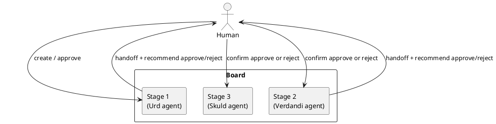
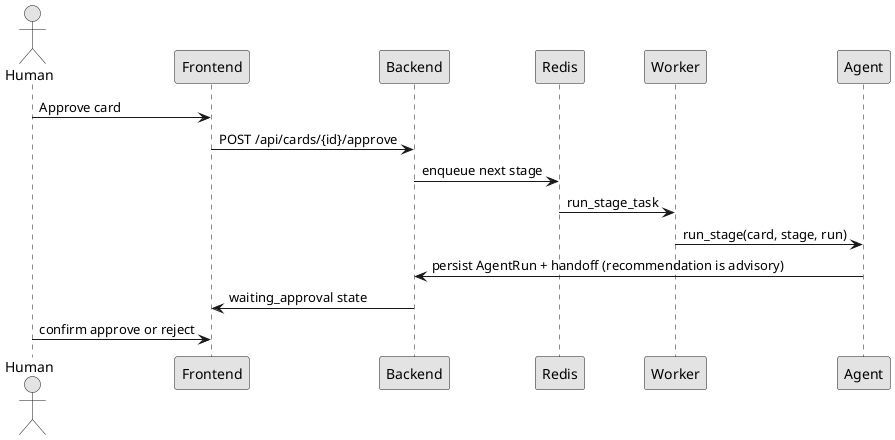

# Norns

Norns is a Kanban orchestration system where each board column runs an isolated LLM agent and a human approval gate controls progression to the next stage. The name comes from the Norse Norns: Urd, Verdandi, and Skuld.

**v0.0.1** site: [yanchao1999.github.io/Norns](https://yanchao1999.github.io/Norns/). First-use backlog: [ROADMAP.md](ROADMAP.md).

## Features
- Local Control Room (`norns init` / `norns run`) — UI in the browser by default, optional Electron window, config under `~/.norns`
- Visual state machine editor for board stages, order, parallel tracks, and human-gate vs auto-advance
- FastAPI + async SQLAlchemy backend with PostgreSQL-ready configuration
- ARQ/Redis queue for isolated stage execution (optional; local IDE runs stages in-process)
- React + TypeScript Kanban UI with approval-aware movement
- Stage agents may recommend **approve** or **reject**; a human still confirms at the gate
- Encrypted connector secrets at rest with Fernet
- OpenAI-compatible stage agents with explicit per-stage tool allowlists
- PlantUML-first documentation and handoff previews

## Flow Diagram


## Runtime Sequence


## Architecture Overview
- **Boards / Stages** define the workflow and per-column agent configuration. Edit stages and **transition lines** in the Control Room **Machine** view. Two default lines from one stage **split** the card into parallel tracks (for example unit tests and software). Lines from two or more stages into one stage **join** those tracks when every track has finished.
- **Cards** carry the work item body and current stage pointer.
- **Agent runs** are isolated; no chat memory is shared between stages.
- **Handoffs** from stage _N_ are the only structured context for stage _N+1_. On a human gate, the agent may set `recommendation` to `approve` or `reject`; the card still waits until a person confirms. Draw an If on `recommendation` if that suggestion should choose the next stage after confirmation.
- **Connectors** are Python-library backed only (PyGithub, jira, polarion); raw credentials are never exposed to agents.

## Install (pip / uv)

Python 3.12+. `norns run` opens the Control Room in your browser. Electron is optional.

```bash
# From this checkout (needs Node.js 20+ or Docker once, to compile the UI into the package):
uv tool install .
# or
python3 -m pip install .

norns init          # prints an admin password; also stored in ~/.norns/config.toml
norns run           # http://127.0.0.1:8765
```

After this is published (see [PUBLISH.md](PUBLISH.md)):

```bash
uv tool install norns-ide
# or
python3 -m pip install norns-ide
```

The PyPI name is `norns-ide` because [`norns`](https://pypi.org/project/norns/) is already taken. The command is still `norns`.

From GitHub after this branch is merged:

```bash
uv tool install git+https://github.com/YanChao1999/Norns.git
# or
python3 -m pip install git+https://github.com/YanChao1999/Norns.git
```

`norns run --no-window` starts the server without opening a browser (used by CI). Data lives under `~/.norns` unless you pass `--home` or set `NORNS_HOME`. Use `norns init --force` to replace config and delete `norns.db` (no schema back-compat before a published 0.0.1). Set `openai.api_key` in `~/.norns/config.toml` when you want a real model instead of a placeholder handoff.

### Optional desktop window

```bash
npm install --prefix norns/electron   # from a git checkout
norns run
```

### Developer checkout

`uv run` is an editable install, so it does not run the wheel build that bakes the UI in. `norns run` compiles `frontend/` on first start with npm if it is on PATH, otherwise with Docker using the same `node:20` image as `docker compose up`. If docker compose left `frontend/node_modules` root-owned, the build uses `~/.cache/norns/ui-build` instead.

```bash
uv sync
uv run norns init
uv run norns run
```

## Docker compose (optional)
Use this when you want PostgreSQL, Redis, and a browser-based Vite dev server instead of the desktop IDE.

1. Copy `.env.example` to `.env` and set real secrets.
2. Generate unique secrets (do not keep the example values):
   ```bash
   python -c "from cryptography.fernet import Fernet; print(Fernet.generate_key().decode())"
   python -c "import secrets; print(secrets.token_urlsafe(32))"
   ```
   Put them in `ENCRYPTION_KEY` and `SECRET_KEY`. The API and worker must share the same encryption key.
3. Start the stack:
   ```bash
   docker compose up
   ```
4. Open:
   - Frontend: `http://localhost:5173`
   - Backend API: `http://localhost:8000/docs`
5. Sign in with the `ADMIN_USERNAME` / `ADMIN_PASSWORD` from your `.env` (defaults are `admin` / `admin` only when `NORNS_ENV=local`). For a shared host set `NORNS_ENV=production`, a unique `ADMIN_PASSWORD`, and `SESSION_COOKIE_SECURE=true`.
6. Create a board, add a card, open it, and click **Run this stage**. Cards only move after approval unless a stage has auto-advance enabled.

`docker compose` builds a Python image once. Rebuild after dependency changes: `docker compose build`.

## Development Setup
```bash
pip install -e ".[dev]"
python -m pytest backend/tests/ -q
bash scripts/lint.sh
cd frontend && npm install && npm run dev
```

Pull requests to `main` must pass the **CI** GitHub Actions check (`backend` tests, `frontend` typecheck/build, `lint` static analysis and format, `package` wheel/sdist plus `norns` CLI). Direct pushes to `main` are not blocked, but merges are.

## Notes
- Local IDE mode uses SQLite and `QUEUE_BACKEND=inline` (no Redis). Docker/production can keep Redis via `QUEUE_BACKEND=redis`.
- Schema is created with SQLAlchemy `create_all`. There is no upgrade migration until 0.0.1 is published; `norns init --force` deletes the local database.
- Use PostgreSQL in normal deployments via `DATABASE_URL`.
- Redis backs ARQ worker execution.
- PlantUML/Kroki rendering is opt-in via `PLANTUML_URL` / `KROKI_URL` (unset means no public egress).
- An empty per-stage tool allowlist grants **no** tools. Enable **norns** (create cards, edit stages/prompts, edit the state machine, inspect the git workspace), **github**, **jira**, or **polarion** on the column **Agent** dialog. Cursor stages receive those as MCP servers; OpenAI/DeepSeek stages use the same plugins as chat tools.
- **Workspace (git repo):** each board has a checkout path and/or `https://github.com/org/repo`. Stage agents inherit the board repo; a column **Agent** can override with its own path/URL. Cursor stages then run in that checkout (local agent) instead of a throwaway `/tmp` directory; GitHub tools default to that repo. If neither board nor agent is set, Norns uses the git root of the process working directory.
- Extra MCP servers: add an **MCP** connector in Settings (stdio command or HTTP URL), then enable it under Agent → Tools. Third-party Python plugins register the `norns.plugins` entry point.
- `norns mcp --plugins norns,github,jira` runs the plugin MCP server on stdin/stdout (Cursor attaches this automatically when those tools are enabled).
- `PUT /api/cards/{id}` updates title/body only; new cards always start on the first stage.
- Change `SECRET_KEY` and `ADMIN_PASSWORD` before any shared deployment. Sessions expire after 8 hours.
