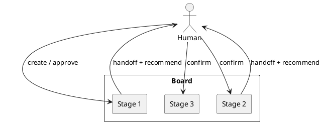

# Norns

Kanban orchestration: each column is an isolated LLM agent, and a human gate decides what moves next. Named after Urd, Verdandi, and Skuld.

[](https://github.com/YanChao1999/Norns/actions/workflows/tests.yml)
[](https://pypi.org/project/norns-ide/)
[](https://pypi.org/project/norns-ide/)
[](https://www.python.org/downloads/)
[](https://github.com/YanChao1999/Norns/actions/workflows/tests.yml)
[](https://github.com/YanChao1999/Norns/blob/main/pyproject.toml)
[](https://github.com/astral-sh/ruff)
[](LICENSE)

Site: [yanchao1999.github.io/Norns](https://yanchao1999.github.io/Norns/) · Backlog: [ROADMAP.md](ROADMAP.md)

## Install

Python 3.12+. The command is `norns`; the package is `norns-ide` (`norns` is taken on PyPI).

```bash
uv tool install norns-ide
# or
python3 -m pip install norns-ide

norns init    # prints an admin password; also stored in ~/.norns/config.toml
norns run     # http://127.0.0.1:8765
```

From this checkout (needs Node.js 20+ or Docker once, to compile the UI):

```bash
uv tool install .
norns init && norns run
uv sync --extra dev && uv run pre-commit install   # format, lint, tests on commit
```

`norns run --no-window` starts the server without a browser. Data lives under `~/.norns` (`--home` / `NORNS_HOME`). `norns init --force` replaces config and deletes `norns.db`. Set `openai.api_key` in `~/.norns/config.toml` for a real model instead of a placeholder handoff. Publishing: [PUBLISH.md](PUBLISH.md).

## Features

- Local Control Room in the browser (`norns init` / `norns run`); optional Electron window
- Visual machine editor: stages, parallel tracks, human gates vs auto-advance
- Isolated per-stage agents (no shared chat memory); human confirms approve/reject
- Encrypted connectors (OpenAI, Cursor, DeepSeek, GitHub, Jira, Polarion)
- Per-column tool allowlists (Norns, sandbox, GitHub, Jira, Polarion, extra MCP)
- SQLite + in-process queue locally; PostgreSQL + Redis/ARQ when you need them



## How it works

- **Boards / stages** — workflow and per-column agents. Two default lines from a stage **split** a card (`handoff.tracks`). Later columns (Review, Merge, …) are a **soft join**: each fork arrives and runs on its own. **Auto-start idle cards** on a column until a human gate (or write confirm) stops it.
- **Sandbox** — local workspace runs copy under `~/.norns/sandboxes/` (`directory`, hardened `docker`, or `none`). Allowlist **sandbox** for reproduce / env-build tools (`sandbox_run` uses docker exec when the container is live).
- **Handoffs** — the only structured context for the next stage. On a gate, `recommendation` is advisory until a person confirms.
- **Connectors** — Python libraries only; agents never see raw credentials. Empty tool allowlist means no tools.

Optional stack (Postgres, Redis, Vite): copy `.env.example` → `.env`, then `docker compose up` → UI at `http://localhost:5173`.
