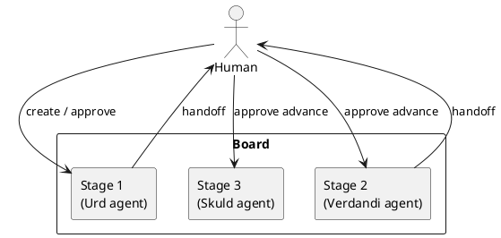
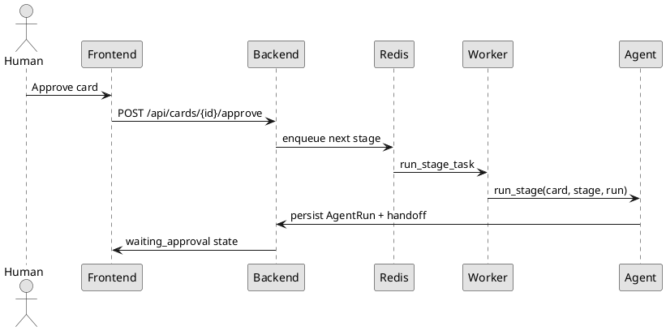

# Norns

Norns is a Kanban orchestration system where each board column runs an isolated LLM agent and a human approval gate controls progression to the next stage. The name comes from the Norse Norns: Urd, Verdandi, and Skuld.

## Features
- FastAPI + async SQLAlchemy backend with PostgreSQL-ready configuration
- ARQ/Redis queue for isolated stage execution
- React + TypeScript Kanban UI with approval-aware movement
- Encrypted connector secrets at rest with Fernet
- OpenAI-compatible stage agents with explicit per-stage tool allowlists
- PlantUML-first documentation and handoff previews

## Flow Diagram


## Runtime Sequence


## Architecture Overview
- **Boards / Stages** define the workflow and per-column agent configuration.
- **Cards** carry the work item body and current stage pointer.
- **Agent runs** are isolated; no chat memory is shared between stages.
- **Handoffs** from stage _N_ are the only structured context for stage _N+1_.
- **Connectors** are Python-library backed only (PyGithub, jira, polarion); raw credentials are never exposed to agents.

## Quick Start
1. Copy `.env.example` to `.env` and set real secrets.
2. Start the stack:
   ```bash
   docker compose up
   ```
3. Open:
   - Frontend: `http://localhost:5173`
   - Backend API: `http://localhost:8000/docs`
4. Sign in with `admin/admin` unless overridden by environment variables.

## Development Setup
```bash
pip install -e ".[dev]"
python -m pytest backend/tests/ -q
cd frontend && npm install && npm run dev
```

## Notes
- Use PostgreSQL in normal deployments via `DATABASE_URL`.
- Redis backs ARQ worker execution.
- PlantUML diagrams are rendered through Kroki with a graceful SVG fallback.
